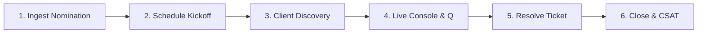

# 📘 GPEG Camps Command Center: Testing Playbook & User Manual

Welcome to the **GPEG Camps Command Center**! This playbook is designed as a comprehensive, one-page testing manual for stakeholders and team leads to explore, evaluate, and understand the capabilities built into this interactive sandbox portal.

---

## 👥 Active Switcher Persona Matrix

The application has a built-in **Active Persona dropdown selector** in the header. Switch between these roles at any time to instantly scope workspaces, views, and dashboard permissions:

*   **Presenter (Lead Delivery Presenter)**: Conducts live workshop sessions, log technical Q&As, and view utilization detail logs. Restricted from CRM sandboxes.
*   **AM (Primary Account AM)**: Swaps to client portfolio. Complete agency discovery surveys and post-camp CSAT feedback cards.
*   **PM (SME Product PM)**: Scopes strictly to the expert PM Escalation Queue to authoritatively resolve client technical tickets.
*   **Organizer (Program Coordinator)**: Full operational access to active pipeline Kanban boards, schedule kickoffs, and ROI KPIs.
*   **Admin (Portal Administrator)**: Full structural diagnostics. Relational Spanner tables, GCS cloud backups, and cloud deploy consoles.

---

## 🔄 Quick-Start: 6-Step E2E Demo Walkthrough

Follow these steps sequentially to stage and execute a complete camp lifecycle test run in the live portal:

### 🎫 Step 1: Nominate a Camp (Role: `Admin` or `Organizer`)
1. Switch your persona to **Admin** or **Organizer**.
2. Click the **Cases Connect Sandbox** tab in the sidebar menu.
3. In the **API Sync Sandbox**, enter:
   * **Agency Name**: `Omnicom Zenith`
   * **AM Email**: `am.zenith@google.com`
   * **Target Curriculum**: `GMP Camp: CM360 Foundations`
   * **Region Scope**: `APAC`
4. Click the **Submit Ticket & Trigger Webhook** button.
*   *Observation: A blue Case Connect Sync toast pops up, and a new camp card is dynamically instantiated in the **Nomination** Kanban column with an `APAC` scope badge.*

### 📅 Step 2: Kickoff & Schedule Session (Role: `Organizer`)
1. Go to the **Presenter Dashboard** tab. Locate the `Omnicom Zenith` card.
2. Click the **Kickoff Session** button (or drag the card into the **Pre-Camp Prep** column).
3. In the scheduler modal:
   * Assign a Lead Presenter (e.g. `Taylor Chen`).
   * Select custom topics in the **✨ Modular Slides Agenda Customizer** checklist (e.g. check `Core Platform 101` and `PLX/Looker Stats`).
   * Choose a scheduled date, platform (`Meet`), and SLA Discovery deadline date.
4. Click **Schedule Session & Start Pre-Camp**.
*   *Observation: The card moves to **Pre-Camp Prep** displaying status `Awaiting Discovery`. Under the hood, the system logs Pre-Camp prep effort hours automatically for Taylor Chen, updating utilization pacings, and drafts an HTML kickoff email in the **Outbox Gateway**.*

### 📝 Step 3: Submit Client Discovery Survey (Role: `AM`)
1. Switch your persona to **AM**. *(Your dashboard is now scoped to Sarah's AM portfolio).*
2. Click the **Agency Portal** tab.
3. In the dropdown selector, select the active `Omnicom Zenith` Case ID.
4. Fill out the **Pre-Camp Discovery Form** and click **Submit Discovery Answers**.
*   *Observation: The card adapts instantly to `Customized Deck` (indicated by a green badge) and updates status to `Discovery Received`.*

### 🎤 Step 4: Launch Live Console & Escalate Query (Role: `Presenter`)
1. Switch your persona to **Presenter**. *(Your dashboard is filtered to Taylor Chen's assigned camps).*
2. Drag the card from **Pre-Camp Prep** to **In-Camp Execution**.
3. Click the **Presenter Console** button on the card.
4. In the live control panel:
   * Review the attendee roll-calls.
   * Navigate the dynamic slide carousels. Note that the **Custom Scheduled Modules** checklist includes the topics chosen during kickoff!
   * In the Q&A bar, type: *“Is cross-advertiser CM360 cookie attribution supported in Safari?”* and click **Escalate to PM**.
5. Click **Finish Workshop**.
*   *Observation: The card conclucles, moving to **Post-Camp SLA**. Under the hood, the system auto-accrues delivery hours for Taylor Chen, pacing their utilization.*

### 🛠️ Step 5: Resolve Technical Ticket (Role: `PM`)
1. Switch your persona to **PM**. *(Navigation locks focus exclusively on PM Queue).*
2. Click the **PM Escalation Queue** tab.
3. Find the `Omnicom Zenith` ticket, type your reply: *“Yes, CM360 S2S API handles attribution programmatically...”* and click **Resolve & Sync Answer**.
*   *Observation: The question resolves. In the **Outbox Gateway**, an email is automatically compiled containing the PM's response in the follow-up body.*

### 📬 Step 6: Send follow-up & Submit CSAT (Role: `Organizer` & `AM`)
1. Switch your persona to **Organizer**.
2. Locate the `Omnicom Zenith` card in the **Post-Camp SLA** column.
3. Click the **Follow-Up Package** button. Note that the email body includes the live Q&A question and PM's synced answer!
4. Click **Send Package & Start 30-Day SLA Tracker**. *(The card moves to closed awaiting feedback).*
5. Switch your persona to **AM**, go to **Agency Portal**, select the case, rate the CSAT (`5/5`), select BFM adoption uplift (`15.5%`), and click **Submit Session Feedback**.
*   *Observation: The case closes as `Impact Logged` with a CSAT score of `5.0` and BFM Uplift of `15.5%`. All ROI dashboards and utilization graphs update automatically.*

---

## 💡 Interactive Features & Indicators Guide

When exploring the sandbox portal, pay attention to these active visual cues and tools:

### ⏱️ SLA Time Machine (Sidebar)
*   *What it is*: Skip calendar date parameters forward by **+2** or **+5** days to test SLA countdown pacing.
*   *SLA Breach Warning*: If the Discovery Form deadline passes, the system sets the card status to `SLA Breached ⚠️`, logs a warning, and **automatically downgrades** the deck protocol back to `Standard Deck`.
*   *Auto-Outbox Email*: The system autonomously compiles and drafts a high-contrast **SLA Breach Notification Email** to the AM inside the outbox gateway.

### ⚠️ Capacity & Presenter Conflict Detector (Weekly Schedule Tab)
*   *What it is*: View presenter scheduling allocations inside the weekly calendar grid.
*   *Alarm Trigger*: If two camps are scheduled for the same presenter within a **90-minute window**, the grid displays a red indicator: `⚠️ PRESENTERS SCHEDULE COLLISION DETECTED` and highlights clashing cards to alert the coordinator.

### 🛡️ Compliance Gating Pulsing Error Cards
*   *What it is*: Locks pipeline transitions from *Post-Camp SLA* to *Closed* unless deliverables are verified.
*   *Pulsing Animation*: Dragging a card before sending follow-up packages, or attempting to close a camp with unarchived Meet recordings or unverified Teams link coordinates will trigger a **pulsing red error border animation** on the card, blocking the transition to protect the team's quality score.

### 🎤 AI Presenter Rehearsal Sandbox (Presenter Rehearsal Tab)
*   *What it is*: Practice segment transitions, voice modulations, and product knowledge.
*   *AI Client Evaluator*: Input settings, read the simulated technical question, type your rehearsal answer, and check delivery checkmarks. The AI Evaluator grades **Accuracy** and **Clarity**, provides recommendations, and logs attempts inside your local history stream.

---
*Prepared for the Google GPEG Partner Operations team by Antigravity.*
